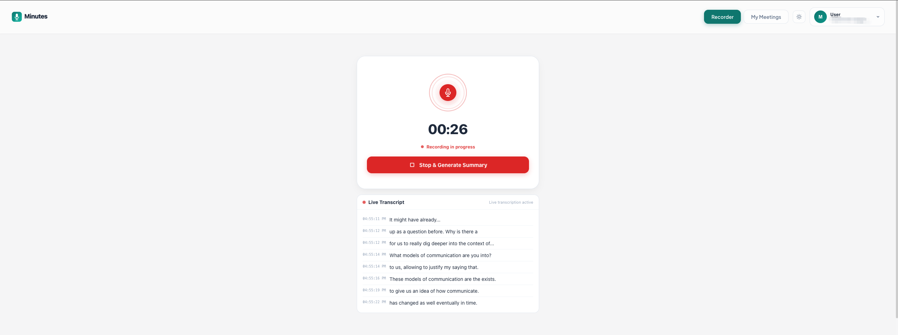
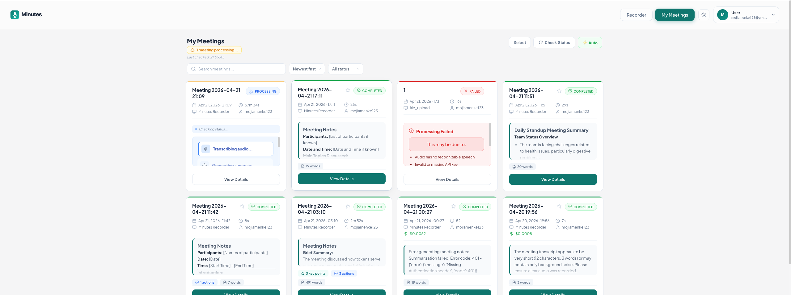
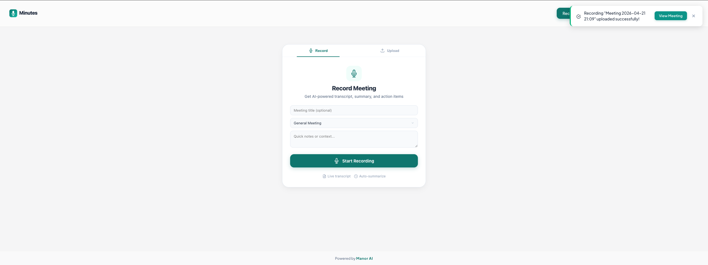
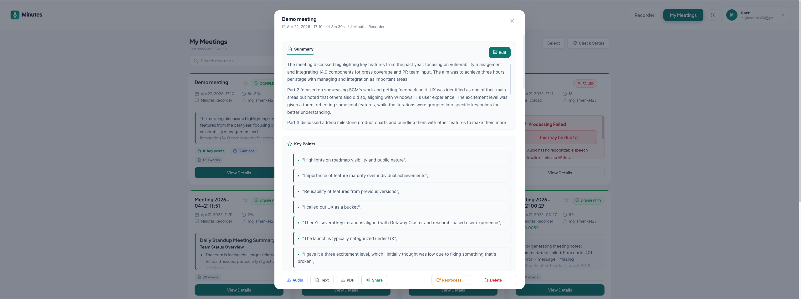

<p align="center">
  
</p>

<h3 align="center">AI Meeting Notes — Open Source, Self-Hosted, Privacy-First</h3>

<p align="center">
  Record meetings, get transcripts, AI summaries, and action items.<br/>
  Run 100% locally with no API keys, or use cloud AI for better accuracy.
</p>

<p align="center">
  <a href="#quick-start">Quick Start</a> · <a href="#features">Features</a> · <a href="#screenshots">Screenshots</a> · <a href="ROADMAP.md">Roadmap</a> · <a href="CONTRIBUTING.md">Contributing</a>
</p>

---

## Quick Start

```bash
npx create-manor-minutes
```

Choose **Local** (no API keys, runs Whisper + Ollama on your machine) or **Cloud API** (OpenAI/OpenRouter).

Or with Docker:

```bash
git clone https://github.com/manor-os/minutes.git
cd minutes
docker compose up -d                          # cloud API mode (set keys in Settings)
# or
docker compose -f docker-compose.yml -f docker-compose.local.yml up -d   # fully local
```

Open **http://localhost:9002** → Register → Start recording.

### Management

```bash
./minutes start       # Start all services
./minutes stop        # Stop
./minutes logs        # View logs
./minutes health      # Check all services
./minutes update      # Pull latest & restart
./minutes backup      # Backup database
./minutes help        # All commands
```

## Screenshots

<p align="center">
  
  
</p>
<p align="center">
  
  
</p>

## Features

### Recording & Transcription
- **Live recording** with real-time transcript (word-by-word streaming)
- **Upload audio** — drag-and-drop MP3, WAV, M4A, WebM, OGG, FLAC, MP4
- **Speaker diarization** — identifies who said what
- **20+ languages** supported for transcription
- **Local STT** — faster-whisper runs on your machine, no API needed

### AI-Powered Analysis
- **Meeting summary** — concise overview of what was discussed
- **Key points** extraction
- **Action items** with assignees and deadlines
- **Meeting templates** — standup, 1-on-1, retrospective, brainstorm, client call, interview
- **AI chat** — ask questions about any meeting ("What did we decide about pricing?")
- **Local LLM** — Ollama (Qwen 2.5) for fully offline summarization

### Organization & Search
- **Cross-meeting search** — full-text search across all transcripts with context snippets
- **Tags & favorites** for organizing meetings
- **Sort & filter** by date, duration, status
- **Bulk operations** — select and delete multiple meetings
- **Inline rename** — double-click to rename meeting titles
- **Pagination** for large libraries

### Collaboration
- **Share meetings** — read-only public links, one click to copy
- **Webhook notifications** — Slack, Discord, or any URL when a meeting is processed
- **Browser notifications** when processing completes
- **Export** — download as Audio, Text, or PDF

### User Experience
- **Dark mode** — system, dark, or light theme
- **Keyboard shortcuts** — `R` record, `S` stop, `Cmd+K` search, `D` dark mode, `?` help
- **Audio playback** in meeting detail
- **Error boundary** — app recovers gracefully from crashes
- **PWA** — installable on mobile

### Self-Hosted & Private
- **100% local mode** — no data leaves your machine (faster-whisper + Ollama)
- **MinIO** object storage for audio files
- **PostgreSQL** database
- **Docker Compose** — one command to deploy everything
- **Your data, your server** — no third-party analytics or tracking

## Architecture

```
Minutes
├── phone-recorder/     React PWA (Vite)
├── browser-extension/  Chrome/Edge extension
├── backend/
│   ├── api/            FastAPI REST API
│   ├── celery_tasks.py Async processing (transcribe → summarize → extract)
│   ├── database/       PostgreSQL models & migrations
│   └── mcp_server/     MCP integration (cloud edition)
├── docker-compose.yml  Base stack (Postgres, Redis, MinIO, Backend, Frontend)
├── minutes             CLI management tool
└── installer/          npx create-manor-minutes
```

### Editions

| | Community (OSS) | Local | Cloud |
|---|---|---|---|
| Auth | Local (email/password) | Local | Manor SSO + Google |
| STT | OpenAI Whisper API | faster-whisper (local) | OpenAI Whisper |
| LLM | OpenRouter / OpenAI | Ollama (local) | OpenRouter |
| Storage | MinIO | MinIO | MinIO |
| API Keys | Set in Settings | None needed | Server-side |
| Cost | Your API usage | Free (your hardware) | Managed |

## Configuration

API keys are configured per-user in **Settings** (not server env vars). Each user brings their own keys.

### Local Mode (no API keys)

```bash
docker compose -f docker-compose.yml -f docker-compose.local.yml up -d
```

Runs faster-whisper for transcription and Ollama (Qwen 2.5 3B) for summarization. Needs ~6GB RAM.

### Cloud API Mode

```bash
docker compose up -d
```

Register → Settings → Enter your OpenAI key (for Whisper) and OpenRouter key (for summarization).

## About

Minutes is the first standalone module from **[Manor AI](https://manorai.xyz)** — an operating system for one-person companies. Meeting notes flow into your Manor knowledge base, and AI agents can reference them to execute tasks.

## License

[MIT](LICENSE)

## Contributing

See [CONTRIBUTING.md](CONTRIBUTING.md) for development setup and guidelines.
